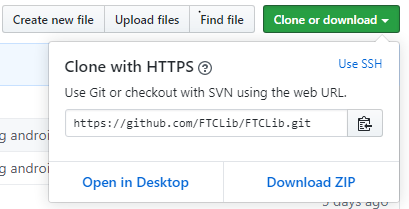
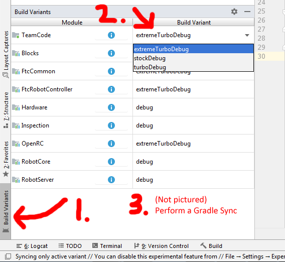

# FTCLib

[](https://gitpod.io/#https://github.com/FTCLib/FTCLib)

Project led by Jackson Isenberg and the Alpharetta Robotics Club

Logo produced by Team RO037

FTCLib is the FTC library to end all libraries. By porting features from wpilib for FRC, FTCLib makes the use of advanced systems extremely easy for even rookie programmers. This wiki will teach you how to use the library and what each class means and represents. The first thing you should do is either download the project as a zip or fork the repository and use Git to clone the forked repository.

If you are downloading the .zip, you can find it here:



If you are cloning a fork of the repository, here are the basic steps:

1. Open Git Bash.
2. In the command line, you should use:
   `git clone https://github.com/username/FTCLib.git`
   Replace username with your GitHub username as the fork is under your GitHub account.
3. Wait for the repository to be cloned.

Once you have the repository, open the project in Android Studio. There you will see the TeamCode folder. This is where you will write your robot code.

FTCLib documentation - <https://ftclib.gitbook.io/ftclib>

## How to use developer release
Add this to your build.common.gradle:
```groovy
    repositories {
        jcenter()
    }
```  
Now, in your TeamCode buid.gradle, add these lines:
```
dependencies {
    implementation 'com.arcrobotics:ftclib:2.0.11' // Replace 2.0.11 with the latest release
}
```
And that's it! (May need to follow installation instructions below, however)

## Origin and Upstream
origin: <https://github.com/FTCLib/FTCLib>

upstream: <https://github.com/OpenFTC/OpenRC-Turbo>

While those two options are the most convenient for most things, another way it to contact one of our members through
the [FTC Discord](https://discord.gg/first-tech-challenge "The FTC Discord") .


## Legality for competition use

This is the second official release of FTCLib! The project is still in the Alpha stage, with many things being untested. The project is being added to constantly, and there will most likely be smaller updates to come in the near future. If you want to contribute to the project, be sure to read the [Contributing.MD](https://github.com/FTCLib/FTCLib-1/blob/dev/CONTRIBUTING.md)

There is still a great need for Alpha testers, so also please contact us if you are interested in that.

# Attention Users!
This library uses Java 8! If you do not already have Java 8 on your FTC Project, please do so! If you do not know how to, read further. __Doing this__ *will* __require all other devices to delete and then reclone the project following the change!__ You get weird Android Studio errors other wise. To change, go to the `build.common.gradle` and find the lines that say

```groovy
    compileOptions {
        sourceCompatibility JavaVersion.VERSION_1_7
        targetCompatibility JavaVersion.VERSION_1_7
    }
```

Change the `7` to an `8` and then perform a Gradle Sync. You now have Java 8 (and all the things that come with it)!

__Features__:

+ WPILib - Style code base
+ Commander - Based System
    + Command manager for OpMode
        + Can add a sequential command
        + Commands can have a scheduled timeout before the next command
        + Commands can have modifiable time between loop iterations
    + Ability for custom commands
    + Ability for custom subsystems
+ Controllers
    + P Controller
        + Set the P gain
        + Runs a given Motor with a given setpoint and a previous value
    + PIDF Controller
        + Proportional (P), Integral (I), Derivative, (D), and Feedforward (F) gains
        + Set a setpoint and a measured value
        + Can set a custom error tolerance for position and velocity
        + Can set the time period for the iteration of the control loop
        + Calculate the output at any time
+ Drive Bases
    + Abstract drive base classes for all kinds of drive bases!
    + Each one has a customizable power range and max speed limit
    + Can clip a value to fit a range
    + Can normalize the speeds for a given set of powers
    + Can square an input
    + Make your own drive base with a certain abstract class
    + Includes robot-centric *and* field-centric driving
    + Customizable for specifc robot dimensions
    + Includes many of the most common drive bases
        + Differential (Tank) Drive
        + Mecanum Drive
        + H-Drive
        + Swerve Drive
            + Includes a Swerve Module with a built-in P controller
            + Can turn motor to an angle
        + Robot Drive
            + Abstract drive base class with basic methods
            + Use to create your own drive bases
+ Gamepad
    + Has many different functions and classes for getting the most out of a gamepad
    + GamepadEx class
        + Set up with a normal Gamepad
        + Read any button value
        + Read any trigger value
    + ButtonReader class
        + A class that represents a gamepad button
        + Many uses including the current state, the recent state, and more
    + TriggerReader class
        + A class that represents a gamepad trigger
        + Includes simular state-changing methods like GamepadButton
        + Can set the trigger name for telemetry
+ Geometry
    + Lots of geometry - related classes and functions
    + Vector2d
    + Pose2d
    + Rotation2d
+ Hardware
    + Has a *lot* of hardware classes, interfaces, and items
    + Includes ready made hardware devices not included in the SDK
    + Many different types of motors and motor related objects
        + CRServo
        + EncoderEx
        + Motor
        + MotorEx
        + MotorGroup
    + Other types of servos
        + SimpleServo
        + ServoEx
    + Lots of different sensors and other items, some can be custom - implemented
        + ExternalEncoder (abstract)
        + JSTEncoder
        + GyroEx (abstract)
        + Rev IMU
        + SensorColor
        + RevColorSensorV3
        + SensorDistance (interface)
        + SensorDistanceEx (interface)
        + SensorRevTOFDistance
+ Kinematics
    + Odometry!
    + Has odometry for a couple of common drive bases
        + DifferentialOdometry
        + MecanumOdometry
    + Easily used and integratable
    + Supports multiple forms of ododmetry
        + Two wheel + Gyro
        + Three wheel + Gyro
        + Three wheel
+ Utility
    + Has a few different utility functions
    + Direction
        + Represents a logical direction
        + LEFT, RIGHT, UP, DOWN, FORWARDS, BACKWARDS
    + Safety
        + Represents an arbitrary safety level
        + SWIFT, EASE_OFF, DEFAULT, BREAK
    + Timing
        + Has a few different functions for a Timer
            + Can set the timer
            + Can pause the timer
            + Can stop the timer
            + Can read if timer is done
            + Can reset the timer
        + Also includes a Rate
            + Can set a rate
            + Can reset the rate
            + Can see if rate has expired yet for refreshing
+ Some Examples in the TeamCode module (limited)

## Installation

1. Open up your FTC SDK Project in Android Studio.

2. Go to your `build.common.gradle` file in your project.

    
    
3. Add the following to the `repositories` section at the bottom of the file.

   ```groovy
   jcenter()
   ```
    
4. Open the `build.gradle` file in your TeamCode module. 
    
    
    
5. Go to the bottom of the file, and add the following.

    ```groovy
    dependencies {
        implementation `com.arcrobotics:ftclib:2.0.11`
    }
    ```
6. Because FTCLib makes use of advanced features, you need to increase the minSdkVersion to 24. Unfortunately, this means that ZTE  Speed Phones are not supported in this release.

In build.common.gradle, change the minSdkVersion from 19 to 24:
```groovy

    defaultConfig {
        applicationId 'com.qualcomm.ftcrobotcontroller'
        minSdkVersion 24
        targetSdkVersion 26
```
    
7. Perform a gradle sync to implement your changes.

    


* **Stock - 40MB APK** *(oof!)*
  - Competition legal

* **Turbo - 10MB APK** *(4x smaller!)*
    *Note: If you would like to use Blocks, you will need to copy your private Vuforia key into the `Blocks/src/main/assets/CzechWolf` file*
  - Vuforia native library loaded dynamically
  - Vuforia/TF datasets loaded dynamically
  - OnBotJava removed

* **Extreme Turbo - 4MB APK** *(10x smaller!)*
  - Vuforia native library loaded dynamically
  - Vuforia/TF datasets loaded dynamically
  - OnBotJava removed
  - Blocks removed
  - Web management removed
  - Sound files removed

__NOTE:__ If your module has a few dependencies, you might have an error related to multidex on building the project.
This is caused by the project exceeding the limit for imports enforced by Android Studio. To solve this, 
add `multiDexEnabled true` to the below location inside the `build.common.gradle` file.

```groovy

    defaultConfig {
        applicationId 'com.qualcomm.ftcrobotcontroller'
        minSdkVersion 24
        targetSdkVersion 26


        multiDexEnabled true
```

## Welcome to FTCLib!

Thank you for using the FTCLib library for your code! All of the people who worked on it have put a lot of effort into making FTCLib an amazing library. We thank you for putting our effort to work with your own projects. We hope you have great luck and success with your programming.

The mission of FTCLib is briefly summarized in the following quote made by Jackson from ARC Robotics, who started the library.


> Our goal is to make programming easier and more efficient through effective classes and detailed examples of implementation. - Jackson ARC Robotics




## Usage

For drivetrain kinematics, you can do:
```java
MecanumDrive dt = new MecanumDrive(motors);

x = gp1.joyLeft.x;
y = gp1.joyLeft.y;
turn = gp1.joyRight.x;

dt.driveRobotCentric(x, y, turn);
```
For a simple CV example that find skystone using built-in detector:
```java
import com.arcrobotics.ftclib.command.CommandOpMode;
import com.arcrobotics.ftclib.vision.SkystoneDetector;

import org.openftc.easyopencv.OpenCvCamera;
import org.openftc.easyopencv.OpenCvCameraFactory;
import org.openftc.easyopencv.OpenCvCameraRotation;
import org.openftc.easyopencv.OpenCvInternalCamera;

// You don't need CommandOpMode, LinearOpMode, and other OpModes work well
public class SkystoneSample extends CommandOpMode {

    OpenCvCamera camera;
    SkystoneDetector pipeline;
    @Override
    public void initialize() {

        int cameraMonitorViewId = hardwareMap.appContext.getResources().getIdentifier("cameraMonitorViewId", "id", hardwareMap.appContext.getPackageName());
        camera = OpenCvCameraFactory.getInstance().createInternalCamera(OpenCvInternalCamera.CameraDirection.BACK, cameraMonitorViewId);
        camera.openCameraDevice();

        pipeline = new SkystoneDetector();

        camera.setPipeline(pipeline);
        camera.startStreaming(640, 480, OpenCvCameraRotation.UPRIGHT);
    }

    @Override
    public void run() {
        // Assuming threaded. It hopefully found the skystone at the end of init.
        SkystoneDetector.SkystonePosition position = pipeline.getSkystonePosition();

        switch (position) {
            case LEFT_STONE:
                break;
            case CENTER_STONE:
                break;
            case RIGHT_STONE:
                break;
            default:
                break;
        }
    }
}

```

## Release Notes

### 5.3B

Released on 22 November 2019

* Fix TFOD crash on stock due to incorrect version of TFOD library being used (which conflicted with pre-compiled official FTC SDK AARs)

### 5.0A

Released on 21 August 2019

* Initial release.
