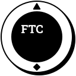

<h1></h1>

*Logo produced by Xing from FTC Team 15303*


Origin: https://github.com/FTCLib/FTCLib

Project led by Jackson Isenberg and the Alpharetta Robotics Club

- - -

FTCLib is a library designed to be the only library you'll need for FTC programming. The project was initially meant to be a port of WPILib, which is the standard programming library for FRC that almost all teams use. However, with FTC, there are a ton of libraries that not many people have heard about, especially rookie teams who are just starting. The goal of FTCLib is to improve the initial programming experience for new members as well as greatly enhance the efficiency of code for veterans.

Please read the documentation and the rest of the README before you get started with the library.

FTCLib documentation - <https://ftclib.gitbook.io/ftclib>

## Installation

1. Open up your FTC SDK Project in Android Studio.

2. Go to your `build.common.gradle` file in your project.

    
    
3. Add the following to the `repositories` section at the bottom of the file.

   ```groovy
   mavenCentral()
   ```
    
4. Open the `build.gradle` file in your TeamCode module. 
    
    
    
5. Go to the bottom of the file, and add the following.

    ```groovy
    dependencies {
        implementation 'org.ftclib.ftclib:core:2.0.1'
        // the following is optional if you want vision
        implementation 'org.ftclib.ftclib:vision:2.0.1'
    }
    ```
6. Because FTCLib makes use of advanced features, you need to increase the minSdkVersion to 24. Unfortunately, this means that ZTE Speed Phones are not supported in this release.

In build.common.gradle, change the minSdkVersion from 23 to 24:
```groovy

    defaultConfig {
        applicationId 'com.qualcomm.ftcrobotcontroller'
        minSdkVersion 24
        targetSdkVersion 28
    }
```
7. Ensure your Java version is set to 8. This should already be the case with the latest SDK.
If not, you will need to change your Java version. Scroll down in `build.common.gradle` until you find the `compileOptions` block.
```groovy
compileOptions {
    sourceCompatibility JavaVersion.VERSION_1_7
    targetCompatibility JavaVersion.VERSION_1_7
}
```
Change the 7 to an 8 like so:
```groovy
compileOptions {
    sourceCompatibility JavaVersion.VERSION_1_8
    targetCompatibility JavaVersion.VERSION_1_8
}
```
    
8. Perform a gradle sync to implement your changes.

    


__NOTE:__ If your module has a few dependencies, you might have an error related to multidex on building the project.
This is caused by the project exceeding the limit for imports enforced by Android Studio. To solve this, 
add `multiDexEnabled true` to the below location inside the `build.common.gradle` file.

```groovy

    defaultConfig {
        applicationId 'com.qualcomm.ftcrobotcontroller'
        minSdkVersion 24
        targetSdkVersion 28


        multiDexEnabled true
    }
```

## Welcome to FTCLib!

Thank you for using the FTCLib library for your code! All of the people who worked on it have put a lot of effort into making FTCLib an amazing library. We thank you for putting our effort to work with your own projects. We hope you have great luck and success with your programming.

The mission of FTCLib is briefly summarized in the following quote made by Jackson from ARC Robotics, who started the library.


> Our goal is to make programming easier and more efficient through effective classes and detailed examples of implementation.

## Why Use FTCLib?

FTCLib is a non-profit, open source, community-driven library created solely with the intent of helping rookie teams learn programming easier and maximizing efficiency for veteran teams. By putting everything into one library, with enough documentation to build a rigorous learning experience, all teams can benefit from using FTCLib. It's fast, easy, efficient, and powerful. The idea is that this truly is the last library you will ever need.

FTCLib still has the ability to be used along with other libraries without conflict. If you still want to use other libraries alongside ours, go ahead. FTCLib's purpose is solely to improve everyone's programming experience in FTC.

## Contributing

Since this is a community-driven, open source library, we are constantly looking for more content. If you feel there is something missing from our library, feel free to contribute! If you want to contribute to the project, be sure to read the [CONTRIBUTING.md](.github/CONTRIBUTING.md).

Please make sure to contact us if you have any other questions.
